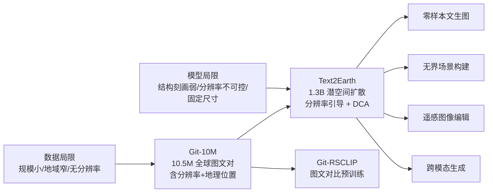

# 01 背景、动机与相关工作

## 1. 研究背景

### 1.1 生成式基础模型的趋势

近年来，以 DALL·E、Stable Diffusion、Imagen 为代表的**生成式基础模型（Generative Foundation Models, GFMs）**依托大规模图文数据，在自然图像文生图上取得了突破，并迅速扩展到医学影像、自动驾驶、虚拟现实等垂直领域。

然而在**遥感领域**，基于基础模型的大规模文生图研究仍然很少。论文认为这一方向在以下场景有很高的应用价值：

- **成像仿真**：在卫星设计、传感器评估阶段生成指定条件的模拟影像；
- **虚拟遥感场景构建**：数字孪生、城市规划可视化；
- **数据增强**：为分类/检测/分割等下游任务合成训练数据（论文第 V-H 节做了验证）。

### 1.2 遥感图像与自然图像的本质差异

论文强调遥感图像具有独特的“上帝视角（God's-eye perspective）”，由此带来三个关键属性：

| 属性 | 说明 | 对生成模型的要求 |
|---|---|---|
| 地理覆盖广 | 地球表面各大洲、各气候带、各类地貌 | **全球尺度**的场景建模能力 |
| 场景多样 | 城市、森林、山地、沙漠、农田、海洋、冰川、港口、机场…… | 强泛化、零样本生成能力 |
| 多分辨率 | 同一类地物在 0.5 m 与 100 m 分辨率下外观完全不同 | **分辨率可控**的生成 |

此外，遥感应用往往需要**大幅面**的场景，因此还需要**无界（unbounded）生成**能力，即突破固定画布尺寸的限制。

> 由此，论文把目标概括为三个关键词：**global-scale、multi-resolution controllable、unbounded**。

---

## 2. 现有工作的两大局限

### 2.1 数据集局限（Dataset Limitations）

论文 Table I 对比了已有的遥感图文数据集：

| 数据集 | 全球尺度 | 含分辨率信息 | 图像数量 |
|---|:---:|:---:|---:|
| UCM | ✗ | ✗ | 2.1k |
| RSICD | ✗ | ✗ | 10.9k |
| NWPU-Captions | ✗ | ✗ | 31.5k |
| RS5M-RS3 | – | ✗ | 2M |
| **Git-10M（本文）** | **✔** | **✔** | **10M** |

问题归纳：
1. **规模小**：最大的 RS5M 子集 RS3 也只有 2M；
2. **多样性不足**：局限于特定地区和特定场景类型；
3. **缺少分辨率信息**：只有简单的图文对，模型无从学习“分辨率—外观”的关系，生成结果的分辨率是不确定的。

### 2.2 模型局限（Model Limitations）

1. 早期 GAN、Transformer 模型**难以刻画全球尺度遥感场景中复杂的结构化地理特征**；
2. **忽视分辨率属性**：生成图像的尺度不可控，无法满足用户指定分辨率的需求；
3. **仅支持固定尺寸的基础文生图**：缺乏作为基础模型泛化到多种文本驱动任务（无界场景构建、图像编辑等）的能力。

---

## 3. 相关工作梳理

### 3.1 计算机视觉中的生成式基础模型

论文将文生图模型分为三条主要技术路线。

#### (1) GAN 路线

| 工作 | 关键思想 |
|---|---|
| Reed et al. (cGAN) | 首次用条件 GAN 做文生图 |
| StackGAN | 两阶段：先生成低分辨率图，再细化为高分辨率图 |
| AttnGAN | 引入注意力机制，对齐文本中的单词与图像区域 |
| MirrorGAN | 强调文本↔图像的双向映射（重描述），保持文本一致性 |
| GigaGAN | 扩大参数规模、大规模数据训练，多分辨率层级结构，可快速生成超高分辨率图像 |
| UFOGen | GAN 与扩散结合，采用 Stable Diffusion 的 UNet，可用预训练 SD 初始化 |

**共性问题**：模式崩塌（mode collapse）、训练不稳定，限制了多样性与质量。

#### (2) 自回归路线

| 工作 | 关键思想 |
|---|---|
| DALL·E | 两阶段：dVAE 离散化图像 → 对文本与图像 token 做自回归建模 |
| CogView | 提出 Precision Bottleneck Relaxation 与 Sandwich LayerNorm，解决大规模训练不稳定问题 |
| Parti | 编码器-解码器结构，把文生图当作“翻译”任务 |
| VAR | “下一尺度预测（next-scale prediction）”取代“下一 token 预测”，在质量、速度、可扩展性上超过扩散模型 |
| ZipAR | 免训练的并行解码，利用图像空间局部性加速自回归生成 |

#### (3) 扩散路线

| 工作 | 关键思想 |
|---|---|
| GLIDE | 比较 CLIP 引导与无分类器引导（CFG） |
| DALL·E 2 | 两阶段：文本 → CLIP 图像嵌入 → 解码成图像 |
| **Stable Diffusion** | **潜空间扩散**，显著降低高分辨率生成的计算量，成为最广泛使用的生成式基础模型（**Text2Earth 的直接基础**） |
| ControlNet | 通过额外条件输入实现空间/结构控制（Text2Earth 的图像翻译实验借鉴了它） |
| DragDiffusion | 基于点拖拽的精确空间控制 |

**优势**：训练稳定、生成多样且逼真。

### 3.2 遥感文生图

| 工作 | 类型 | 关键思想 / 不足 |
|---|---|---|
| Bejiga et al. | cGAN | 首个遥感文生图工作，根据古代文本描述生成“复古遥感图像” |
| Bejiga 后续工作 | cGAN + doc2vec | 提取物体类型、属性、空间关系等多层级文本信息；但生成图像分辨率低、细节不足 |
| StrucGAN (Zhao et al.) | 多阶段 GAN | 判别器中嵌入无监督分割模块提取结构信息，保证结构一致性 |
| BTD-sGAN | GAN | 用 Perlin 噪声替代高斯噪声，并以分割掩码 + 文本作为条件 |
| Txt2Img-MHN (Xu et al.) | 自回归 | 现代 Hopfield 网络自回归生成视觉嵌入；结合 VQVAE / VQGAN 离散化；通过 Hopfield Lookup 做由粗到细的层级原型学习 |
| DiffusionSat | 扩散 | 基于 SD，引入 3D ControlNet，扩展更多条件生成任务（也使用了 GSD 等元数据） |
| CRS-Diff | 扩散 | 侧重可控遥感图像生成（是 Table II 中此前最好的方法） |
| RSDiff | 扩散 | 类 Imagen 的两阶段：低分辨率扩散 + 超分扩散 |

**论文对现有工作的总体判断**：受限于训练数据的多样性，这些方法难以充分捕捉全球尺度遥感场景中复杂、结构化的地理特征，也难以作为基础模型泛化到无界场景构建、图像编辑等多种文本驱动生成任务。

> 补充说明（分析者注）：论文把 DiffusionSat 归入“侧重扩展条件生成任务”的工作。实际上 DiffusionSat 也把 GSD、经纬度、拍摄时间等**数值型元数据**编码后加到时间步嵌入上，与 Text2Earth 的分辨率引导思路相近。论文没有在实验中与 DiffusionSat 直接比较，也没有讨论两者的异同，这是相关工作部分的一个缺口。

---

## 4. 本文的定位

论文自述的三项贡献：

1. **全球尺度数据集**：Git-10M 是规模最大的遥感图文数据集，地理多样性强、元数据丰富，为生成模型训练提供坚实基础；
2. **生成式基础模型**：Text2Earth 是基于扩散的强大基础模型，能根据文本生成多样的全球地理场景与多分辨率图像，“从近景细节到大范围覆盖”；
3. **泛化与灵活性**：在零样本文生图、无界场景构建、图像编辑、跨模态生成等任务上表现出色，超越此前受限于固定尺寸和特定场景的模型；在 RSICD 基准上 FID 提升 26.23，零样本分类 OA 提升 20.95%。
