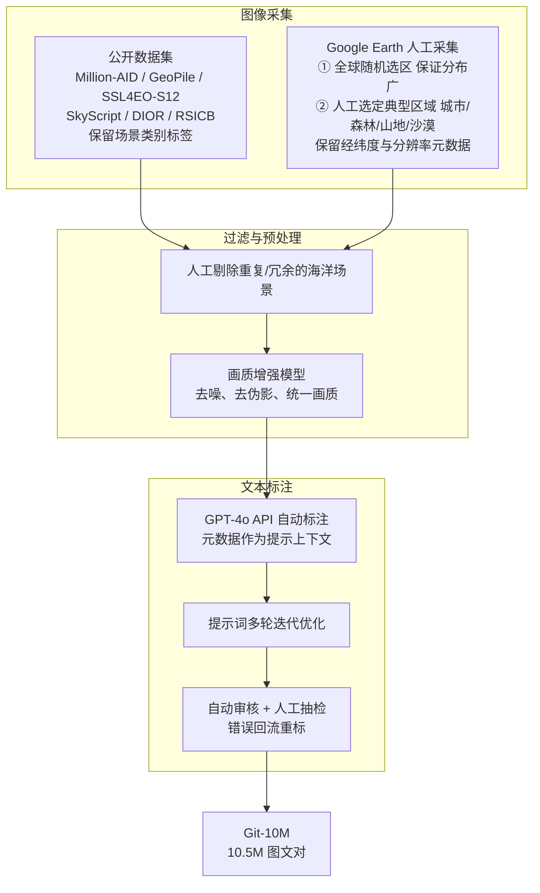

# 02 Git-10M 数据集

> Git = **G**lobal-scale **i**mage-**t**ext。共 **1050 万**对遥感图文数据，每对带**地理位置**与**分辨率**信息。
> 下载：HuggingFace `lcybuaa/Git-10M`，ModelScope `lcybuaa1111/Git-10M`。

---

## 1. 构建流程总览

---

## 2. 图像采集与预处理（论文 III-A）

### 2.1 数据来源

**(a) 公开数据集**（主要是场景分类数据集，图像质量较高）：

| 数据集 | 说明 |
|---|---|
| Million-AID | 百万级航空影像场景分类数据集 |
| GeoPile | GFM 持续预训练所用的地理空间数据集合 |
| SSL4EO-S12 | 大规模多模态、多时相自监督数据集（Sentinel-1/2） |
| SkyScript | 大规模、语义多样的遥感视觉-语言数据集 |
| DIOR | 光学遥感目标检测基准 |
| RSICB | 众包构建的大规模遥感场景分类基准 |

关键做法：**保留每张图的场景类别标签**，在后续标注阶段作为先验，让 GPT-4o 生成语义更准确的描述。

**(b) Google Earth 人工采集**（为扩大规模和地理覆盖）：
1. **全球随机选区**，保证样本分布足够广；
2. **人工挑选特定区域**，保证城市、森林、山地、沙漠等典型地物都有充分覆盖；
3. 全程**保留每张图的元数据**（地理位置、分辨率），为后续分析和标注提供依据。

论文 Fig. 2 指出：**大部分图像来自 Google Earth**，并声称这些图像允许公开分享与再分发。

### 2.2 过滤与画质增强

1. **去冗余**：人工筛除重复或冗余的海洋场景，保持地理分布的多样性（海洋在随机采样中占比天然很高）。
2. **画质增强**：
   - 动机：部分采集图像存在噪声、伪影等问题，会损害生成模型的训练；
   - 方法：在**私有的高质量遥感数据集**上训练一个图像增强模型，然后用它处理**全部**采集图像；
   - 训练方式：**模拟多种退化过程**（模糊、加噪、压缩等），构造“低质—高质”图像对，学习从退化图像到高质量图像的映射（即 Real-ESRGAN 一类的盲图像复原思路）；
   - 作用：统一整个数据集的画质，使其更适合高质量生成建模；
   - 开源情况：论文承诺开源该增强模型，仓库 `Tools/` 目录已提供（网络为 RRDBNet，详见仓库分析文档）。

---

## 3. 文本标注（论文 III-B）

千万级图像无法人工标注，因此作者设计了基于 **OpenAI GPT-4o API** 的自动标注流水线，并配合提示词优化与标注审核策略。

### 3.1 元数据增强的提示词

- 如果图像带有**地理位置、分辨率、场景类别**等元数据，就把这些属性作为额外上下文写入给 GPT-4o 的提示词，显著提升描述的相关性；
- 例：一张标签为 “airport” 的图像，会把 “airport” 写进提示词，引导模型生成语义更准确的描述。

### 3.2 提示词迭代优化

- 不使用 “Describe the image content” 这类简单指令；
- 经过多轮迭代，设计出**强调场景上下文、地理特征等语义细节**的复杂提示词。
- 论文**没有公开具体提示词模板**，这对复现标注过程是一个缺失。

### 3.3 质量审核机制

| 机制 | 处理的问题 |
|---|---|
| **自动审核** | GPT-4o 超时、网络错误导致图像上传失败，从而输出错误文本 |
| **人工周期性抽检** | 评估生成文本的准确性 |
| **错误回流** | 审核中发现的错误反馈到流水线：修改提示词，并对出错样本重新处理 |

---

## 4. 数据集分析（论文 III-C）

### 4.1 地理覆盖（Fig. 3）

- 样本覆盖多个大洲和地理区域，包括城市、森林、山地、沙漠等典型场景；
- 来自公开分类数据集的部分带有明确的场景标签，例如 AID 有 30 类、RSICB 有 45 类，保证了场景类型的丰富性。

### 4.2 分辨率分布（Fig. 4）

- 覆盖从**高分辨率 0.5 m/pixel 到低分辨率 128 m/pixel**；
- 高分辨率图像捕捉精细特征，适合需要细粒度信息的任务；低分辨率图像覆盖更大范围；
- 多分辨率特性是训练“**指定尺度生成**”模型的基础。

> 分析者注：0.5 m ~ 128 m 正好是 2 的 0 ~ 8 次幂的跨度（共 9 档）。这与 Google 地图瓦片的缩放级别 Level 18 ~ 10 一一对应（\(\text{Res} = 2^{17-\text{Level}}\)）。由此推断，Google Earth 部分的分辨率元数据本质上就是**采集时使用的瓦片缩放级别**，这与官方代码中 `{Level}_GOOGLE_LEVEL_` 的提示词前缀一致。需要注意，真实瓦片的地面分辨率还随纬度变化（约乘以 \(\cos\varphi\)），论文的换算公式是忽略纬度影响的近似。

### 4.3 图像质量评估（Fig. 5）

- 使用广泛使用的**美学评分模型**（LAION improved-aesthetic-predictor，基于 CLIP 特征的线性/MLP 评分器）对增强前后的图像打分；
- 结果：增强后的分数分布整体右移，画质显著提升；
- 这一分数在训练中还有第二个用途：**第二阶段微调只使用美学分数大于 4.8 的高质量子集**（见实验篇）。

> 分析者注：美学评分器是在自然图像（LAION）上训练的，用它衡量遥感图像质量是一种代理指标。它与遥感专业意义上的画质（锐度、噪声、辐射一致性）未必完全一致，论文没有讨论这一点。

### 4.4 文本分析（Fig. 6）

- 词云显示描述涵盖的概念和地物非常丰富；
- **平均每条文本约 52 个词**；
- 总计超过 1050 万条文本。论文写作“超过 55 亿词（5.5 billion words）”，但按 10.5M × 52 ≈ 5.46 亿词计算，**应为约 5.5 亿（0.55 billion）**，原文很可能是数量级笔误。

---

## 5. 与现有数据集的对比小结

| 维度 | 现有数据集 | Git-10M |
|---|---|---|
| 规模 | 2.1k ~ 2M | **10.5M**（约为此前最大者的 5 倍） |
| 地理覆盖 | 局部区域 | **全球** |
| 分辨率元数据 | 无 | **有**（0.5 m ~ 128 m） |
| 地理位置元数据 | 大多无 | **有** |
| 文本 | 人工短句（RSICD 等通常十几个词） | GPT-4o 长描述（平均约 52 词） |
| 画质控制 | 无 | 统一增强 + 美学评分 |

---

## 6. 数据集层面的观察与潜在问题（分析者观点）

1. **文本长度与 CLIP 上限不匹配**：平均 52 词，加上标点和子词切分，往往超过 OpenCLIP 文本编码器 77 token 的上限，长描述的尾部信息在训练时会被截断。论文没有说明是否做了截断或摘要处理。
2. **文本风格差异**：GPT-4o 生成的长描述与 RSICD 等人工短句风格差异很大，这可能是在 RSICD 上需要 LoRA 微调才能取得最佳指标的原因之一。
3. **合成标注的偏差**：GPT-4o 可能产生幻觉（例如数错物体数量），这与论文第 VI 节承认的“数量控制不准”局限可能有关。
4. **增强带来的分布偏移**：所有图像都经过同一增强模型，生成模型学到的是“增强后”的分布，可能带有该模型特有的纹理风格（例如过度锐化）。
5. **版权与许可**：大部分图像来自 Google Earth，论文称允许分享与再分发，但商业使用场景仍需单独核实 Google Earth 的使用条款。
