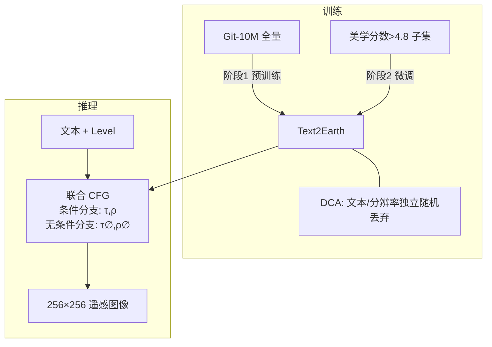

# 03 Text2Earth 模型与方法

> 对应论文第 IV 节。文中标注“【论文】”的内容来自论文原文；标注“【核实】”的内容是分析者根据 HuggingFace 上公开的权重和配置文件（`lcybuaa/Text2Earth`、`lcybuaa/Text2Earth-inpainting`）核实的结果，用来补全论文没有写明的细节。

---

## 1. 整体结构

【论文】Text2Earth 是一个 13 亿参数、基于扩散框架的生成式基础模型，由三部分组成：**图像压缩编码**、**条件嵌入机制**、**扩散建模**。具体组件：

| 组件 | 作用 | 【核实】参数量 / 精度 |
|---|---|---|
| VAE（编码器 \(\mathcal{E}\) / 解码器 \(\mathcal{D}\)） | 像素空间 ↔ 潜空间的压缩与重建 | 83.7M，FP32 |
| OpenCLIP ViT-H 文本编码器 \(\mathcal{T}\) | 文本 → 高维语义嵌入 \(\tau\) | 340.4M，FP32（隐藏维 1024，23 层） |
| 分辨率嵌入模块 \(f_\theta\) | 分辨率 → 隐式嵌入 \(\rho\) | 约 2.05M（包含在 UNet 内） |
| 带交叉注意力的去噪 UNet \(\epsilon_\theta\) | 多步噪声预测 | 868.0M，FP16 |
| **合计** | | **≈ 1.292B**，与论文所说的 1.3B 一致 |

【核实】UNet 配置中 `_name_or_path` 指向 `stabilityai/stable-diffusion-2-base`，编辑版指向 `stabilityai/stable-diffusion-2-inpainting`。也就是说，**Text2Earth 是在 Stable Diffusion 2 的结构和预训练权重基础上，增加分辨率嵌入后在 Git-10M 上继续训练得到的**。论文正文没有明确说明这一初始化来源。

```mermaid
flowchart LR
    subgraph Cond[条件嵌入]
        T[文本 I_t] --> TE[OpenCLIP ViT-H<br/>文本编码器] --> tau[τ ∈ R^(L×d)<br/>L=77, d=1024]
        R[分辨率 I_s<br/>Google Level] --> RE[分辨率嵌入 f_θ] --> rho[ρ]
        TS[时间步 t] --> TME[时间步嵌入 g_θ] --> gt[g_θ t]
        rho --> ADD((+))
        gt --> ADD --> cst[c_st]
    end
    subgraph Diff[潜空间扩散]
        X[图像 x] --> E[VAE 编码器 E] --> z0[z_0]
        z0 -->|加噪 q| zt[z_t]
        XM[掩码图像 x_m] --> E2[VAE 编码器 E] --> zm[z_m]
        zt --> CAT[通道拼接 C]
        zm -.编辑版.-> CAT
        CAT --> UNet[去噪 UNet ε_θ<br/>ResBlock + Cross-Attn]
        cst --> UNet
        tau -->|K,V| UNet
        UNet --> eps[ε̂] -->|T 步迭代| z0hat[ẑ_0] --> D[VAE 解码器 D] --> Xhat[生成图像 x̂]
    end
```

---

## 2. 图像压缩编码（VAE）

【论文】给定输入图像 \(x \in \mathbb{R}^{H\times W\times C}\)，编码器 \(\mathcal{E}\) 通过多尺度特征提取和逐级下采样，把它压缩成隐式表示 \(z \in \mathbb{R}^{h\times w\times c}\)（\(h<H,\ w<W\)）；解码器重建：

\[
\hat{x} = \mathcal{D}(z),\qquad \hat{x}\approx x
\]

目的：在潜空间而不是像素空间做扩散，在保持保真度的同时大幅降低计算量。这对大幅面、无界生成至关重要。

【核实】VAE 为 SD 标准 `AutoencoderKL`：`block_out_channels=[128,256,512,512]`，下采样 8 倍，潜变量 4 通道。训练和推理使用 256×256 像素，对应潜变量 \(32\times32\times4\)，压缩比为 \(256\cdot256\cdot3/(32\cdot32\cdot4)=48\) 倍。潜变量缩放系数沿用默认的 0.18215。

---

## 3. 扩散建模

### 3.1 前向加噪

【论文】

\[
z_t = \sqrt{\bar\alpha_t}\, z_0 + \sqrt{1-\bar\alpha_t}\,\epsilon,\qquad \epsilon\sim\mathcal{N}(0, I),\qquad \bar\alpha_t=\prod_{i=1}^{t}\alpha_i
\]

【核实】噪声调度沿用 SD2：`num_train_timesteps=1000`，`beta_schedule="scaled_linear"`，\(\beta\in[0.00085,\,0.012]\)，预测目标为 \(\epsilon\)（epsilon-prediction）。

### 3.2 训练目标

【论文】

\[
\min_\theta\ \mathcal{L}_{LDM}=\mathbb{E}_{z_0,\ \epsilon\sim\mathcal{N}(0,1),\ t}\Big[\big\|\epsilon-\epsilon_\theta(z_t,\ t,\ \tau,\ \rho)\big\|_2^2\Big]
\]

与标准 LDM 相比，唯一的区别是条件中**多了分辨率嵌入 \(\rho\)**。

---

## 4. 条件嵌入机制

### 4.1 文本条件：交叉注意力

【论文】

\[
\tau=\mathcal{T}(I_t),\quad \tau\in\mathbb{R}^{L\times d}
\]

\[
\mathrm{Attention}(Q,K,V)=\mathrm{Softmax}\!\left(\frac{QK^\top}{\sqrt{d_k}}\right)V
\]

其中 \(Q\) 来自带噪潜变量 \(z_t\) 的中间特征，\(K,V\) 来自文本嵌入 \(\tau\)。

【核实】`cross_attention_dim=1024`，注意力头配置 `[5,10,20,20]`（SD2 的写法，实际每头 64 维），使用线性投影（`use_linear_projection=true`）。文本最长 77 token。

### 4.2 分辨率引导机制（本文核心方法创新）

【论文】分辨率信息 \(I_s\) 经过投影层编码为分辨率嵌入 \(\rho\)，与时间步嵌入 \(g_\theta(t)\) 相加：

\[
c_{st}=\rho+g_\theta(t)=f_\theta(I_s)+g_\theta(t)
\]

\(c_{st}\) 输入 UNet，在**每一个扩散步**调节生成图像的分辨率。

【核实】实现上的具体形式：

1. **分辨率的表示**：不直接用“米/像素”，而用 Google 地图缩放级别 Level（10 ~ 18 的整数），\(\text{Res}=2^{17-\text{Level}}\)：

   | Level | 10 | 11 | 12 | 13 | 14 | 15 | 16 | 17 | 18 |
   |---|---|---|---|---|---|---|---|---|---|
   | 分辨率 (m/px) | 128 | 64 | 32 | 16 | 8 | 4 | 2 | 1 | 0.5 |

   Level 采用对数刻度，相邻档位的分辨率相差 2 倍，比线性的“米数”更适合编码。**Level = 0 被用作“未知分辨率”（\(\rho_\varnothing\)）**。

2. **\(f_\theta\) 的结构**：UNet 配置 `class_embed_type="timestep"`，因此
   \[
   f_\theta(I_s)=\mathrm{MLP}\big(\mathrm{SinEmb}_{320}(I_s)\big),\quad \mathrm{MLP}: \mathrm{Linear}(320\!\to\!1280)\to\mathrm{SiLU}\to\mathrm{Linear}(1280\!\to\!1280)
   \]
   也就是说，**Level 被当作一个“时间步”**，先用与时间步相同的正弦位置编码（无参数）映射为 320 维，再经过一个与时间步 MLP 同构、但参数独立的 MLP 得到 1280 维向量。

3. **注入方式**：\(c_{st}\) 与时间步嵌入一样，经过每个 ResNet 块的 `time_emb_proj` 线性层后，作为**通道偏置**加到特征图上（`resnet_time_scale_shift="default"`，即加性方式，而不是 scale-shift）。因此分辨率是一个作用于整个网络、所有空间位置的**全局条件**。

> 方法本质评述：这是一个**轻量、标准**的设计，与 SD 的类别条件、DiffusionSat 的元数据嵌入、SDXL 的尺寸/裁剪条件属于同一范式，只增加约 200 万参数。它的有效性主要来自 Git-10M 中**大规模、真实的分辨率标注**，而不是结构本身的复杂度。

### 4.3 掩码图像条件编码（编辑版 Text2Earth-inpainting）

【论文】给定被掩码的图像 \(x_m\in\mathbb{R}^{H\times W\times C}\)，经 VAE 编码得到 \(z_m\in\mathbb{R}^{h\times w\times c_m}\)，与扩散过程中的 \(z_t\) 在通道维拼接：

\[
z_{cond}=[z_m,\ z_t]\in\mathbb{R}^{h\times w\times(c+c_m)}
\]

然后送入去噪 UNet。用户用**白色掩码**指定需要生成内容的区域，可以是整幅图（等价于文生图），也可以是局部区域（编辑、去云、外扩）。

【核实】实际结构与 SD2-inpainting 一致：UNet 输入为 **9 通道 = 4（\(z_t\)）+ 1（下采样后的掩码）+ 4（\(z_m\)）**，拼接顺序为 \([z_t,\ m,\ z_m]\)。论文公式**省略了掩码通道**，拼接顺序也写反了。编辑版同样带分辨率嵌入（`class_embed_type="timestep"`）。

---

## 5. 动态条件自适应策略（Dynamic Condition Adaptation, DCA）

DCA 的目的：(1) 提升生成质量与一致性；(2) 在文本或分辨率条件**缺失**时，模型仍能正常工作。它包括两个阶段。

### 5.1 训练：动态条件丢弃（Algorithm 1）

【论文】训练时以预设概率**分别、独立地**随机丢弃文本条件和分辨率条件：

```text
Algorithm 1  Training with Dynamic Conditioning
1:  repeat
2:    x0 ~ q(x0)                         # 从数据分布采样图像
3:    z0 = E(x0)                         # VAE 编码
4:    t ~ Uniform({1,...,T})             # 随机时间步
5:    ε ~ N(0, I)                        # 采样高斯噪声
6:    c_text ~ Bernoulli(p1)             # 随机丢弃文本
7:    c_res  ~ Bernoulli(p2)             # 随机丢弃分辨率
8-9:  I_t, I_s ← x0 对应的文本与分辨率
10:   if c_text == 1: τ ← τ_∅  else: τ ← T(I_t)
15:   if c_res  == 0: ρ ← ρ_∅  else: ρ ← f_θ(I_s)
20:   梯度下降: ∇θ || ε − ε_θ( √ᾱ_t z0 + √(1−ᾱ_t) ε, t, τ, ρ ) ||²
21: until converged
```

这样训练出的模型同时覆盖四种条件组合：

| 文本 | 分辨率 | 学到的能力 |
|:---:|:---:|---|
| ✔ | ✔ | 完整条件生成 |
| ✔ | ✗ | 只给文本，模型自行决定尺度（论文 V-D 节：输入 “There is a dense forest” 可生成不同尺度的森林） |
| ✗ | ✔ | 只给分辨率，生成该尺度下的多样场景（Fig. 9） |
| ✗ | ✗ | 无条件生成，为 CFG 提供“无条件分支” |

> 注意：算法中两个指示变量的语义**不一致**（`c_text==1` 表示丢弃，而 `c_res==0` 表示丢弃）。论文也没有给出 \(p_1, p_2\) 的具体数值。详见 05 篇。

### 5.2 采样：可伸缩条件引导（Algorithm 2）

【论文】受 Classifier-Free Guidance 启发，每个去噪步预测两份噪声：一份带完整条件，一份为空条件，然后加权组合：

\[
\epsilon_g=(1+\omega)\,\epsilon_\theta(z_t,t,\tau,\rho)-\omega\,\epsilon_\theta(z_t,t,\tau_\varnothing,\rho_\varnothing)
\]

```text
Algorithm 2  Sampling with Scalable Condition Guidance
1:  x_T ~ N(0, I)
2-5: τ ← T(I_t);  ρ ← f_θ(I_s)
6:  for t = T, ..., 1:
7:     z ~ N(0, I) if t > 1 else z = 0
8:     ε_g = (1+ω) ε_θ(z_t, t, τ, ρ) − ω ε_θ(z_t, t, τ_∅, ρ_∅)
9:     z_{t−1} = 1/√α_t · ( z_t − (1−α_t)/√(1−ᾱ_t) · ε_θ(z_t, t, τ) ) + σ_t z
10: end for
11: x0 ← D(z0)
```

要点：
- **文本与分辨率被联合引导**：无条件分支同时把两者置空，而不是分别引导（没有使用 InstructPix2Pix 那种双引导系数）。
- \(\omega\) 控制条件依从程度：越大越贴合条件，但多样性和画质会下降（实验中 \(\omega=3\) 最优）。
- 第 9 行是 DDPM 祖先采样的更新公式。按理应使用 \(\epsilon_g\)，原文写成了 \(\epsilon_\theta(z_t,t,\tau)\)，属于笔误。

**与 diffusers 写法的换算**：diffusers 中 CFG 写作 \(\epsilon_u+s(\epsilon_c-\epsilon_u)=s\,\epsilon_c-(s-1)\,\epsilon_u\)，所以论文的 \(\omega\) 与代码中的 `guidance_scale` \(s\) 满足 \(s=1+\omega\)。官方 README 示例使用 `guidance_scale=3.5`（相当于 \(\omega=2.5\)）；论文最优的 \(\omega=3.0\) 若按此换算，对应 `guidance_scale=4.0`。论文实验中的 \(\omega\) 究竟指哪一种定义，原文没有说清。

---

## 6. 两个版本的模型

| 版本 | 论文记号 | HF 名称 | 输入 | 用途 |
|---|---|---|---|---|
| 文生图版 | Text2Earth\(_t\) | `lcybuaa/Text2Earth` | 文本 + 分辨率 | 零样本文生图、跨模态 LoRA、图像翻译 |
| 编辑版 | Text2Earth\(_e\) | `lcybuaa/Text2Earth-inpainting` | 文本 + 分辨率 + 图像 + 掩码 | 局部编辑、去云、无界外扩 |

---

## 7. 方法小结



| 设计 | 作用 | 新颖度（分析者评估） |
|---|---|---|
| 潜空间扩散 + OpenCLIP + 交叉注意力 | 高效、高质量的文生图主干 | 沿用 SD2 |
| 分辨率嵌入（时间步式编码 + MLP，与 \(t\) 嵌入相加） | 分辨率可控 | 低至中：范式成熟，但首次在千万级遥感数据上系统验证 |
| 掩码图像拼接 | 编辑、外扩 | 沿用 SD-inpainting |
| DCA（独立丢弃 + 联合 CFG） | 条件缺失时的鲁棒性、质量与多样性的权衡 | 低：本质是 CFG 条件丢弃在多条件情形下的直接推广 |
| 两阶段训练（全量 → 高质子集） | 提升画质 | 低：与 SD/SDXL 的美学微调一致 |
