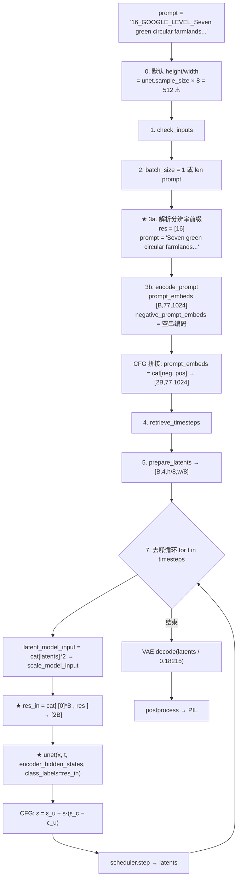

# 02 文生图 Pipeline 实现详解：`Text2EarthDiffusionPipeline`

> 文件：`src/diffusers/pipelines/stable_diffusion/pipeline_text2earth_diffusion.py`（1101 行）
> 来源：复制自同目录下的 `pipeline_stable_diffusion.py`（`StableDiffusionPipeline`，1066 行），在此基础上修改。

---

## 1. 与 SD 原版的差异（完整 diff）

逐行对比后，作者只做了下面 5 处修改：

| # | 位置（行号） | 改动 | 性质 |
|---|---|---|---|
| 1 | 48、50 | 文档字符串示例中的类名和模型 ID 改为 `Text2EarthDiffusionPipeline` / `lcybuaa/Text2Earth` | 文档 |
| 2 | 132 | `class StableDiffusionPipeline` → `class Text2EarthDiffusionPipeline` | 重命名 |
| 3 | **930–953** | **新增：从提示词中解析分辨率级别 `res`，并去掉前缀** | ★ 核心 |
| 4 | **1030–1036** | **新增：构造 CFG 两个分支的分辨率张量 `res_in`** | ★ 核心 |
| 5 | **1044** | **新增：调用 UNet 时传入 `class_labels=res_in`** | ★ 核心 |

除此之外，`__init__`、`encode_prompt`、`prepare_latents`、调度器调用、VAE 解码、安全检查等**全部沿用 SD 原版**。`guidance_scale` 的默认值在这个 pipeline 里**仍是 7.5**（只有重绘 pipeline 改成了 3.5），README 示例显式传入了 3.5。

---

## 2. 组件构成（`__init__`）

沿用 SD 原版，组件来自 HF 模型仓库的 `model_index.json`：

| 组件 | 类 | 说明 |
|---|---|---|
| `vae` | `AutoencoderKL` | 8 倍下采样，4 通道潜变量 |
| `text_encoder` | `transformers.CLIPTextModel` | OpenCLIP ViT-H 的文本塔（23 层，隐藏维 1024） |
| `tokenizer` | `transformers.CLIPTokenizer` | 最大长度 77 |
| `unet` | `UNet2DConditionModel` | **`class_embed_type="timestep"`**，这是分辨率条件生效的前提 |
| `scheduler` | `model_index.json` 中声明为 `PNDMScheduler` | `scheduler_config.json` 的 `_class_name` 却是 `DDIMScheduler`。按 diffusers 的加载逻辑，实际实例化的是 model_index 中声明的类（PNDM）；README 示例换成了 `EulerDiscreteScheduler` |
| `safety_checker` / `feature_extractor` | 置为 `None` | `requires_safety_checker=false` |

`vae_scale_factor = 2 ** (len(block_out_channels) - 1) = 8`（第 266 行）。

---

## 3. `__call__` 全流程



### 3.1 步骤 3a：解析分辨率前缀（第 930–953 行）

```python
# FIXME: 判断prompt是str还是list
if prompt is not None and isinstance(prompt, str):
    if '_GOOGLE_LEVEL_' in prompt:
        res = [int(prompt.split('_GOOGLE_LEVEL_')[0])]   # 前缀 → 整数 Level
        prompt = prompt.split('_GOOGLE_LEVEL_')[-1]      # 去掉前缀，只保留描述
    else:
        res = [0]                                        # 没有前缀 → 0 = “未知分辨率”
        prompt = prompt.split('_GOOGLE_LEVEL_')[-1]
elif prompt is not None and isinstance(prompt, list):
    res_list, prompt_buff = [], []
    for p in prompt:
        if '_GOOGLE_LEVEL_' in p:
            res = int(p.split('_GOOGLE_LEVEL_')[0]); p = p.split('_GOOGLE_LEVEL_')[-1]
        else:
            res = 0;                                  p = p.split('_GOOGLE_LEVEL_')[-1]
        res_list.append(res); prompt_buff.append(p)
    res, prompt = res_list, prompt_buff
```

**协议**：`"{Level}_GOOGLE_LEVEL_{文本}"`

| 输入 | 解析结果 |
|---|---|
| `"16_GOOGLE_LEVEL_Seven green circular farmlands"` | `res=[16]`（2 m/px），`prompt="Seven green circular farmlands"` |
| `"Seven green circular farmlands"` | `res=[0]`（未知分辨率），提示词不变 |
| `"18_GOOGLE_LEVEL_"` | `res=[18]`，`prompt=""`（只给分辨率，对应论文 Fig. 9） |
| `["10_GOOGLE_LEVEL_forest", "river"]` | `res=[10, 0]`，`prompt=["forest", "river"]`（批量生成，可以混合） |

设计要点：
- 前缀是**纯文本约定**，因此在调用接口上不需要新增参数，可以直接兼容 diffusers 的 `StableDiffusionPipeline` 签名和 Hub 的 `custom_pipeline` 机制；
- 前缀在**送入文本编码器之前被去掉**，所以 CLIP 看不到 `16_GOOGLE_LEVEL_` 这样的字符串，文本条件和分辨率条件完全解耦；
- 这与训练数据的组织方式一致：Git-10M 的文本中很可能就带有这个前缀（训练代码未开源，无法确认）。

### 3.2 步骤 3b：文本编码（沿用原版）

- `encode_prompt` 对去掉前缀后的 `prompt` 做 CLIP 编码，得到 `[B, 77, 1024]`；
- 开启 CFG（`guidance_scale > 1`）且没有传 `negative_prompt` 时，负向嵌入是**空字符串 `""` 的编码**（第 427 行 `uncond_tokens = [""] * batch_size`），对应论文中的 \(\tau_\varnothing\)；
- 然后拼成 `[neg, pos]`，形状为 `[2B, 77, 1024]`。

### 3.3 步骤 7：去噪循环中的分辨率注入（第 1030–1048 行）

```python
# fixme
assert num_images_per_prompt == 1
res      = torch.tensor(res, dtype=t.dtype, device=device).clone().detach()
res_null = torch.tensor([0]*batch_size, dtype=t.dtype, device=device).clone().detach()
res_in   = torch.cat([res_null, res]) if self.do_classifier_free_guidance else res

noise_pred = self.unet(
    latent_model_input, t,
    encoder_hidden_states=prompt_embeds,
    timestep_cond=timestep_cond,
    class_labels=res_in if self.unet.class_embedding is not None else None,  # ★
    cross_attention_kwargs=self.cross_attention_kwargs,
    added_cond_kwargs=added_cond_kwargs,
    return_dict=False,
)[0]
```

逐行说明：

| 代码 | 作用 | 备注 |
|---|---|---|
| `assert num_images_per_prompt == 1` | 强制每个提示词只出一张图 | 因为 `res` 没有按 `num_images_per_prompt` 复制，批次维会对不上。这是偷懒的写法，可以用 `repeat_interleave` 修复 |
| `torch.tensor(res, dtype=t.dtype)` | 把列表转为张量，dtype 跟随时间步 | PNDM/DDIM 的时间步是 int64，Euler 的是 float32；正弦编码内部会 `.float()`，两者都能用。**注意它放在循环内部**：第 2 步起 `res` 已经是张量，再次 `torch.tensor(tensor)` 会触发 PyTorch 的 UserWarning，并产生不必要的拷贝 |
| `res_null = [0]*batch_size` | 无条件分支的分辨率，等于 0 | 对应论文的 \(\rho_\varnothing\) |
| `torch.cat([res_null, res])` | 顺序与 `prompt_embeds = cat[neg, pos]` 对齐 | 前半个批次 = (空文本, Level 0)，后半个批次 = (文本, Level)，实现论文 Algorithm 2 的**联合**空条件 |
| `class_labels=... if self.unet.class_embedding is not None else None` | 只有 UNet 带类别嵌入时才传 | 因此这个 pipeline 加载普通 SD 权重也能运行（分辨率被忽略） |

### 3.4 CFG 合成（沿用原版，第 1051–1053 行）

```python
noise_pred_uncond, noise_pred_text = noise_pred.chunk(2)
noise_pred = noise_pred_uncond + self.guidance_scale * (noise_pred_text - noise_pred_uncond)
```

即 \(\epsilon=\epsilon_\theta(\tau_\varnothing,\rho_\varnothing)+s\,[\epsilon_\theta(\tau,\rho)-\epsilon_\theta(\tau_\varnothing,\rho_\varnothing)]\)。与论文公式的换算关系是 \(s=1+\omega\)。

---

## 4. 分辨率条件在 UNet 内部如何生效（diffusers 原生代码，未修改）

这部分代码作者**没有改动**，但它才是“分辨率引导机制”真正执行的地方。

### 4.1 类别嵌入层的构建

`src/diffusers/models/unets/unet_2d_condition.py` 第 606–641 行 `_set_class_embedding`：

```python
elif class_embed_type == "timestep":
    self.class_embedding = TimestepEmbedding(timestep_input_dim, time_embed_dim, act_fn=act_fn)
```

在 Text2Earth 的配置下：`timestep_input_dim = block_out_channels[0] = 320`，`time_embed_dim = 4 × 320 = 1280`，`act_fn = "silu"`。

`TimestepEmbedding` = `Linear(320→1280) → SiLU → Linear(1280→1280)`，参数量 \(320\cdot1280+1280+1280\cdot1280+1280 = 2{,}050{,}560\)。HF 权重的 safetensors 头部中确实有 `class_embedding.linear_1.weight [1280, 320]` 和 `class_embedding.linear_2.weight [1280, 1280]`（FP16）。

### 4.2 前向计算

第 932–946 行 `get_class_embed`，以及第 1133–1143 行 `forward`：

```python
# 1. 时间步嵌入
t_emb = self.time_proj(timesteps)              # 正弦编码 [2B, 320]（无参数）
emb   = self.time_embedding(t_emb)             # MLP → [2B, 1280]

# 2. 分辨率（类别）嵌入
class_labels = self.time_proj(class_labels)    # ★ 与时间步共用同一个正弦编码器
class_labels = class_labels.to(dtype=sample.dtype)
class_emb    = self.class_embedding(class_labels)   # 独立的 MLP → [2B, 1280]

# 3. 相加
emb = emb + class_emb                          # c_st = g_θ(t) + f_θ(I_s)
```

正弦编码（`embeddings.py` 第 27 行 `get_timestep_embedding`，`flip_sin_to_cos=True`、`freq_shift=0`）：

\[
\mathrm{SinEmb}(x)_k=\begin{cases}\cos(x\cdot\omega_k) & k<160\\ \sin(x\cdot\omega_{k-160}) & k\ge160\end{cases},\qquad \omega_j=10000^{-j/160}
\]

- Level = 10 ~ 18 时，高频分量能很好地区分相邻整数；
- **Level = 0 时，编码是常向量 \([1,\dots,1,0,\dots,0]\)**，经 MLP 后成为一个固定的“未知分辨率”嵌入。训练时随机把 Level 置 0（DCA），模型便学会了把它当作空条件。

### 4.3 注入到每个 ResNet 块

`emb` 传给 UNet 中所有 `ResnetBlock2D`，每个块内：

```python
temb = self.time_emb_proj(SiLU(emb))[:, :, None, None]   # [2B, C_out, 1, 1]
hidden_states = hidden_states + temb                       # 加性偏置（resnet_time_scale_shift="default"）
```

因此，分辨率条件和时间步条件一起，以**逐通道偏置**的形式作用于所有分辨率层级的所有 ResNet 块（下采样 4 级 × 2 层、中间块、上采样 4 级 × 3 层），对整幅图的所有空间位置生效。

### 4.4 张量形状一览（256×256，B = 1，开启 CFG）

| 张量 | 形状 | 内容 |
|---|---|---|
| `latents` | `[1, 4, 32, 32]` | 初始高斯噪声 × `init_noise_sigma` |
| `latent_model_input` | `[2, 4, 32, 32]` | 复制两份 |
| `prompt_embeds` | `[2, 77, 1024]` | [空文本, 文本] |
| `res_in` | `[2]` | `[0, 16]` |
| `t_emb` / `emb` | `[2, 320]` / `[2, 1280]` | 时间步嵌入 |
| `class_emb` | `[2, 1280]` | 分辨率嵌入 |
| UNet 输出 | `[2, 4, 32, 32]` | [\(\epsilon_u\), \(\epsilon_c\)] |
| 解码图像 | `[1, 3, 256, 256]` | VAE 解码 |

---

## 5. 使用示例与参数建议

### 5.1 基本用法（README Usage 2）

```python
import torch
from diffusers import Text2EarthDiffusionPipeline, EulerDiscreteScheduler

model_id = "lcybuaa/Text2Earth"
scheduler = EulerDiscreteScheduler.from_pretrained(model_id, subfolder="scheduler")
pipe = Text2EarthDiffusionPipeline.from_pretrained(
    model_id, torch_dtype=torch.float16, scheduler=scheduler, safety_checker=None
).to("cuda")

level = 16                                   # 2 m/px
prompt = f"{level}_GOOGLE_LEVEL_Seven green circular farmlands are neatly arranged on the ground"
image = pipe(prompt, height=256, width=256,  # ⚠ 必须显式指定 256
             num_inference_steps=50, guidance_scale=3.5).images[0]
```

### 5.2 参数建议

| 参数 | 建议 | 原因 |
|---|---|---|
| `height`/`width` | **256** | 默认值是 `sample_size(64) × 8 = 512`，而模型在 256 上训练，512 属于分布外 |
| Level | 10 ~ 18 的整数 | 训练数据只覆盖这 9 档；0 表示不指定；其他值属于外推，且必须是整数（代码用 `int()` 解析） |
| `guidance_scale` | 3 ~ 5 | 论文最优 ω = 3（对应 s = 3 ~ 4，取决于 ω 的定义）；README 用 3.5 |
| `num_images_per_prompt` | 只能为 1 | 有 assert 限制；要多张图请传提示词列表，或用不同的 `generator` 多次调用 |
| 调度器 | Euler / DDIM / DPM-Solver++ 都可以 | README 用 Euler，50 步 |
| `prompt_embeds` | **不要单独使用** | 不传 `prompt` 时 `res` 未定义，会报错（见 06 篇） |

### 5.3 批量生成 / 分辨率扫描

```python
prompts = [f"{lv}_GOOGLE_LEVEL_There are many buildings on a commercial area" for lv in range(10, 19)]
images = pipe(prompts, height=256, width=256, guidance_scale=3.5).images   # 一次生成 9 档分辨率
```

---

## 6. 小结

| 问题 | 答案 |
|---|---|
| 分辨率从哪里输入？ | 提示词前缀 `{Level}_GOOGLE_LEVEL_` |
| 分辨率在 pipeline 中如何传递？ | 解析成整数张量，作为 `class_labels` 传给 UNet |
| 分辨率在网络里如何编码？ | 正弦编码（与时间步共用）+ 独立的两层 MLP（约 205 万参数） |
| 分辨率如何影响生成？ | 与时间步嵌入相加，作为所有 ResNet 块的逐通道偏置 |
| CFG 如何处理分辨率？ | 无条件分支 = 空文本 + Level 0，文本和分辨率**联合**引导 |
| 作者写了多少代码？ | 约 35 行（解析、构造张量、传参） |
