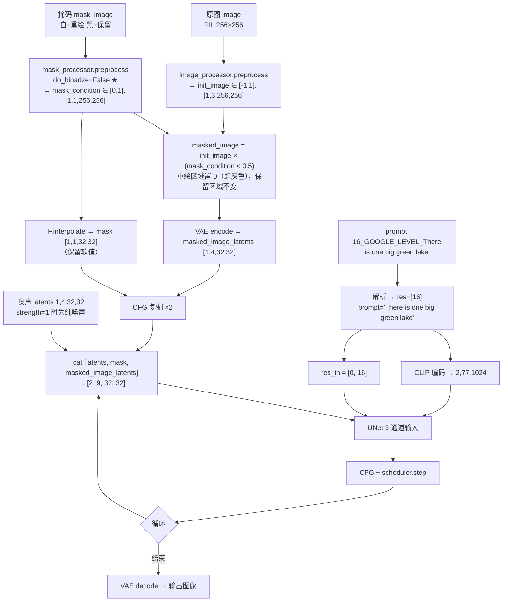

# 03 局部重绘 Pipeline 与 ControlNet 改动详解

---

## Part A：`Text2EarthDiffusionInpaintPipeline`

> 文件：`src/diffusers/pipelines/stable_diffusion/pipeline_text2earth_diffusion_inpaint.py`（1520 行）
> 来源：复制自 `pipeline_stable_diffusion_inpaint.py`（`StableDiffusionInpaintPipeline`，1466 行）
> 对应模型：`lcybuaa/Text2Earth-inpainting`（UNet 从 `stable-diffusion-2-inpainting` 初始化，`in_channels=9`，`class_embed_type="timestep"`）
> 对应论文：Text2Earth\(_e\)，用于图像编辑、去云、无界外扩

### A.1 与 SD 原版重绘 pipeline 的差异

| # | 行号 | 改动 | 影响 |
|---|---|---|---|
| 1 | 237 | 类名改为 `Text2EarthDiffusionInpaintPipeline` | — |
| 2 | **378–384** | **`mask_processor` 的 `do_binarize=True` → `False`**（原代码注释保留，并标注 `# FIXME:`） | ★ 掩码不再被二值化，支持**软掩码** |
| 3 | **1009** | **`guidance_scale` 默认值 7.5 → 3.5** | 与论文推荐值对齐 |
| 4 | 1135、1149 | 文档字符串中的类名 | — |
| 5 | **1227–1252** | **分辨率前缀解析**（与文生图 pipeline 完全相同） | ★ |
| 6 | 1310 | 仅增加注释 `# range: (-1,1)` | — |
| 7 | 1345 | 增加一行被注释掉的代码 `# masked_image[masked_image == 0] = -1` | 作者曾尝试把被遮挡区域填成黑色（-1），最终没有采用 |
| 8 | **1414–1421** | **构造 `res_in`**（与文生图 pipeline 相同） | ★ |
| 9 | **1428** | **`class_labels=res_in` 传给 UNet** | ★ |
| 10 | 1455 | 增加一行被注释掉的“反向掩码混合”代码 | 调试残留 |
| 11 | 1476–1487 | 增加一段被注释掉的、在循环内解码中间结果的调试代码 | 调试残留 |

### A.2 完整数据流



### A.3 关键实现细节

#### (1) 9 通道输入（第 1411–1412 行）

```python
if num_channels_unet == 9:
    latent_model_input = torch.cat([latent_model_input, mask, masked_image_latents], dim=1)
```

- 通道构成：`4（带噪潜变量 z_t）+ 1（下采样掩码）+ 4（掩码图像潜变量 z_m）= 9`；
- 论文公式写作 \(z_{cond}=[z_m,z_t]\)，**省略了掩码通道，顺序也相反**，实际以代码为准；
- 由于 UNet 的 `conv_in` 是 `[320, 9, 3, 3]`（已用 safetensors 头部核实），这种通道拼接是从 SD2-inpainting 继承来的结构。

#### (2) 软掩码（`do_binarize=False`）

SD 原版的 `mask_processor` 会把掩码二值化（大于等于 0.5 取 1，否则取 0）。作者关闭了二值化，带来两处不同：

| 用途 | 代码 | 掩码形式 |
|---|---|---|
| 生成“被遮挡图像” | `masked_image = init_image * (mask_condition < 0.5)` | **硬阈值**（仍按 0.5 二值化） |
| 送入 UNet 的掩码通道 | `F.interpolate(mask_condition, size=(32,32))` | **软值**（0 ~ 1 连续） |

效果：掩码边缘可以有渐变（例如羽化后的掩码），UNet 会看到“过渡带”，有利于去云这类边界模糊的任务和外扩时的接缝融合。这可能与作者训练时使用的掩码形式一致（训练代码未公开，无法确认）。

> README 示例的掩码 `images/sparse_residential_310.png` 在 2025-09 的提交中被替换过（从 1,044 字节变为 5,932 字节）。

#### (3) 被遮挡区域填充为 0

`init_image` 的取值范围是 [-1, 1]，所以 0 对应**中灰色**。被注释掉的 `masked_image[masked_image == 0] = -1` 是作者尝试改为黑色的痕迹。保持 0 与 SD-inpainting 的训练约定一致。

#### (4) `strength` 与 4 通道分支

- 默认 `strength=1.0`，从纯噪声开始，原图信息**只通过 `masked_image_latents` 通道**进入模型；
- 第 1441–1454 行是 SD 原版为 **4 通道 UNet**（普通文生图模型硬做重绘）准备的“每步把保留区域替换回原图加噪潜变量”的逻辑。Text2Earth-inpainting 是 9 通道模型，**不会走这个分支**。

#### (5) `padding_mask_crop`（沿用原版）

如果传入 `padding_mask_crop`，会先根据掩码的外接矩形加上边距裁剪出局部区域，在局部区域内重绘，再贴回原图。这样可以对大图的小区域做高分辨率编辑，**是实现大图编辑/外扩的一个现成工具**。

### A.4 用法与应用场景

```python
import torch
from diffusers import Text2EarthDiffusionInpaintPipeline
from diffusers.utils import load_image

pipe = Text2EarthDiffusionInpaintPipeline.from_pretrained(
    "lcybuaa/Text2Earth-inpainting", torch_dtype=torch.float16, safety_checker=None
).to("cuda")

init_image = load_image("images/sparse_residential_310.jpg")
mask_image = load_image("images/sparse_residential_310.png")   # 白色 = 重绘
image = pipe(prompt="There is one big green lake",              # 可加 "{Level}_GOOGLE_LEVEL_" 前缀
             image=init_image, mask_image=mask_image,
             height=256, width=256, num_inference_steps=50, guidance_scale=3.5).images[0]
```

> README 的 Usage 2 在使用本地类时仍然传了 `custom_pipeline=...` 和 `trust_remote_code=True`。这两个参数在这里是多余的，去掉即可，也能避免执行远程代码。

| 论文应用 | 用这个 pipeline 实现的方式（分析者整理） |
|---|---|
| 去云 | 掩码 = 云区域，提示词可为空或描述地物 |
| 替换 / 添加地物 | 掩码 = 目标区域，提示词 = 新内容（如 “A blue building”） |
| 无界外扩 | 仓库**没有提供脚本**。思路：建立大画布 → 把已生成图块平移，使新区域落在 256×256 窗口内 → 掩码 = 未生成区域（白）+ 与已有内容的重叠带（黑）→ 每一步使用**相同的 Level** → 循环拼接（论文强调分辨率一致是外扩连贯的关键） |
| 整图生成 | 掩码全白，等价于带分辨率的文生图 |

---

## Part B：被就地修改的 ControlNet 代码

> 对应论文 V-G-2“图像到图像翻译”：冻结 Text2Earth，用一个**受 ControlNet 启发的可训练模块**编码输入模态（PAN/NIR/SAR/低分辨率/雾图），生成目标模态。

### B.1 `models/controlnet.py`：1 行改动（第 769 行附近）

```python
if self.class_embedding is not None:
    ...
    if self.config.class_embed_type == "timestep":
        class_labels = self.time_proj(class_labels)
        class_labels = class_labels.to(dtype=sample.dtype)   # ★ 新增
    class_emb = self.class_embedding(class_labels).to(dtype=self.dtype)
    emb = emb + class_emb
```

**原因**：`time_proj`（正弦编码）总是输出 FP32，而 ControlNet 以 FP16 运行时，`class_embedding` 的权重是 FP16，dtype 不一致会报错。UNet 的 `get_class_embed` 里本来就有这行转换，但上游 `ControlNetModel` 漏掉了，作者补上。这说明**作者训练的 ControlNet 也带有 `class_embed_type="timestep"` 的分辨率嵌入**（ControlNet 通常从 UNet 复制初始化，会继承这个配置）。

### B.2 `pipelines/controlnet/pipeline_controlnet.py`：就地加入分辨率逻辑

修改的是 diffusers 官方的 **`StableDiffusionControlNetPipeline`**（没有新建类），共 3 处：

1. **第 1120 行后**：插入与 Text2Earth pipeline 完全相同的 `_GOOGLE_LEVEL_` 解析代码；
2. **第 1293 行附近**：在去噪循环中构造 `res_in`（同样带 `assert num_images_per_prompt == 1`）；
3. **两次调用都传入 `class_labels`**：

```python
down_block_res_samples, mid_block_res_sample = self.controlnet(
    control_model_input, t, encoder_hidden_states=controlnet_prompt_embeds,
    controlnet_cond=image,
    class_labels=res_in if self.controlnet.class_embedding is not None else None,   # ★
    conditioning_scale=cond_scale, guess_mode=guess_mode, return_dict=False)

noise_pred = self.unet(
    latent_model_input, t, encoder_hidden_states=prompt_embeds,
    class_labels=res_in if self.unet.class_embedding is not None else None,          # ★
    down_block_additional_residuals=down_block_res_samples,
    mid_block_additional_residual=mid_block_res_sample, ...)
```

### B.3 评价与隐患

| 方面 | 说明 |
|---|---|
| 功能 | 让 ControlNet 和 Text2Earth UNet 都能接收分辨率条件，构成论文中图像翻译实验的推理代码 |
| **可用性** | **ControlNet 权重没有发布**，所以这部分代码目前无法直接使用，只能作为自行训练 ControlNet 后的推理参考 |
| **副作用** | 修改的是官方类，安装本仓库后，**所有使用 `StableDiffusionControlNetPipeline` 的代码都会受影响**：① 强制 `num_images_per_prompt == 1`；② 提示词中的 `_GOOGLE_LEVEL_` 会被解析；③ 只传 `prompt_embeds` 时会因为 `res` 未定义而报错 |
| **Bug** | `guess_mode=True` 且开启 CFG 时，ControlNet 只接收条件分支（批次为 B），但 `res_in` 的批次为 2B，形状不匹配会报错 |

---

## Part C：三个 pipeline 的共性实现模式

```python
# 1. 解析：从提示词中剥离 "{Level}_GOOGLE_LEVEL_"
res, prompt = parse_level(prompt)              # 无前缀 → 0

# 2. 编码文本（不含前缀）
prompt_embeds = cat([encode(""), encode(prompt)])

# 3. 每步构造分辨率条件，并与 CFG 批次对齐
res_in = cat([zeros(B), res])                 # [无条件, 有条件]

# 4. 作为 class_labels 送入所有带 class_embedding 的网络
unet(..., class_labels=res_in)
controlnet(..., class_labels=res_in)          # 若有
```

这一模式在三个文件中被**复制粘贴**了三次（包括 `# FIXME`、`# fixme`、`# TODO` 注释）。更好的做法是把解析逻辑抽成工具函数，并把 `res` 改为显式参数（例如 `resolution_level: Optional[int] = None`）。
