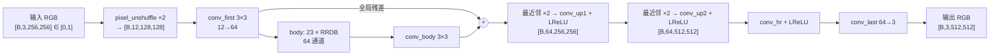
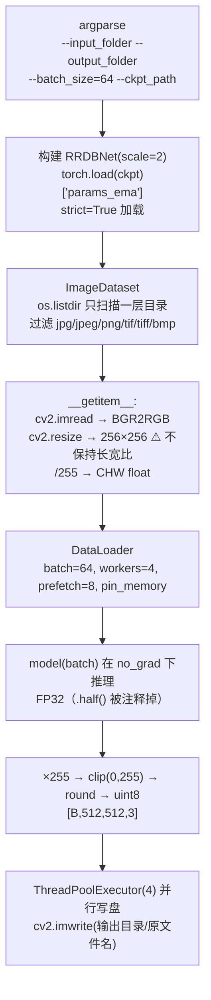

# 04 画质增强工具解析：`Tools/visual_enhancement.py`

> 对应论文 III-A：“在私有高质量遥感数据集上训练图像增强模型，模拟模糊、噪声、压缩等退化，学习从退化图像到高质量图像的映射，并应用于所有采集图像。”
> 文件：`Tools/visual_enhancement.py`（268 行）+ `Tools/best_PSNR_iter_22000_new.pth`（67,037,912 字节）
> 上传时间：2025-05-27（提交 `47b4438`）

---

## 1. 结论先行

| 问题 | 答案 |
|---|---|
| 用的什么网络？ | **RRDBNet**，即 ESRGAN / Real-ESRGAN 的生成器，23 个 RRDB 块，64 通道 |
| 放大倍数？ | **×2**（`scale=2`，先 pixel-unshuffle 下采样 2 倍，再上采样 4 倍） |
| 输入 / 输出尺寸？ | 输入**强制缩放到 256×256**，输出 **512×512** |
| 权重格式？ | BasicSR 训练框架的格式：`{'params_ema': OrderedDict}`，即 EMA 权重 |
| 训练方式？ | 代码中没有训练部分。从文件名 `best_PSNR_iter_22000` 推断：以 PSNR 为验证指标挑选出的第 22000 次迭代的模型，大概率是 **PSNR 导向（L1 损失）训练**，而不是带 GAN 损失的感知导向训练 |
| 参数量？ | 约 **16.70M**（与 67 MB 的 FP32 文件大小吻合） |

---

## 2. 网络结构

### 2.1 总体结构



### 2.2 组件代码解析

#### `ResidualDenseBlock`（RDB，第 75–96 行）

5 层 3×3 卷积，**稠密连接**（每层输入为前面所有层输出的拼接），增长通道数为 32：

```text
x1 = LReLU(conv1(x))                      64        → 32
x2 = LReLU(conv2([x, x1]))                96        → 32
x3 = LReLU(conv3([x, x1, x2]))            128       → 32
x4 = LReLU(conv4([x, x1, x2, x3]))        160       → 32
x5 =       conv5([x, x1, x2, x3, x4])     192       → 64
return x5 * 0.2 + x                       # 残差缩放 0.2（ESRGAN 的经验值）
```

#### `RRDB`（Residual-in-Residual Dense Block，第 99–114 行）

3 个 RDB 串联，外面再套一层残差，同样乘以 0.2：`out = RDB3(RDB2(RDB1(x))) * 0.2 + x`。

#### `pixel_unshuffle`（第 117–138 行）

把空间维折叠到通道维：`[B,C,H,W] → [B,C·s²,H/s,W/s]`。如果尺寸不能被 s 整除，会**裁掉多余的行列**。
对 `scale=2` 的模型来说，这一步让主干在 1/2 分辨率上运算，节省计算量（Real-ESRGAN ×2 模型的标准做法）。

#### `RRDBNet`（第 142–181 行）

- `scale=2` 时 `num_in_ch = 3 × 4 = 12`；
- 主干后接**两次**“最近邻上采样 ×2 + 卷积”，总放大倍数为 \(\frac{1}{2}\times4=2\)；
- `scale==8` 的 `conv_up3` 分支在 `forward` 中已被注释掉，本模型用不到。

#### `AttentionBlock` 与 `get_norm`（第 23–72 行）

定义了一个 QKV 自注意力块，但在 `make_layer` 中插入它的代码被注释掉了，**实际没有使用**，属于作者实验的残留。

### 2.3 参数量核算

| 模块 | 参数量 |
|---|---:|
| conv_first (12→64) | 6,976 |
| 单个 RDB | 239,808 |
| 单个 RRDB（3 × RDB） | 719,424 |
| body（23 × RRDB） | 16,546,752 |
| conv_body + conv_up1 + conv_up2 + conv_hr（各 64→64） | 4 × 36,928 = 147,712 |
| conv_last (64→3) | 1,731 |
| **合计** | **16,703,171（≈ 16.70M）** |

FP32 存储约 66.8 MB，与权重文件大小（67.0 MB，含 zip/pickle 开销）一致。

### 2.4 权重文件核实（静态分析，未执行 pickle）

对 `.pth` 文件（zip 格式）中的 `data.pkl` 做 `pickletools` 反汇编：

- 顶层键只有 **`params_ema`**（BasicSR 保存 EMA 权重的约定）；
- 共 **702** 个张量，从 `conv_first.weight` 到 `conv_last.bias`，与上面的结构完全对应（2 + 23×3×5×2 + 5×2 = 702）；
- pickle 中引用的全局对象只有 `collections.OrderedDict`、`torch.FloatStorage`、`torch._utils._rebuild_tensor_v2`，**都是安全的白名单对象**。因此可以放心改用 `torch.load(..., weights_only=True)` 加载，脚本当前的写法没有利用这一安全选项。

---

## 3. 推理流程（`__main__`，第 209–267 行）



### 3.1 命令行参数

| 参数 | 默认值 | 说明 |
|---|---|---|
| `--input_folder` | `F:\Input_IMG_all` | ⚠ Windows 路径，必须显式指定 |
| `--output_folder` | `H:\Output_IMG_all` | ⚠ Windows 路径，必须显式指定 |
| `--batch_size` | 64 | 输出 512×512 的 64 通道特征图非常占显存，在 T4（16 GB）上可能需要调小 |
| `--ckpt_path` | `./best_PSNR_iter_22000_new.pth` | 相对路径，需要在 `Tools/` 目录下运行 |

正确的调用方式（README 写的是 `visual_quality_enhancement.py --input_dir/--output_dir`，与实际不符）：

```bash
cd /data/workspace/Text2Earth/Tools
python visual_enhancement.py --input_folder /path/to/images --output_folder /path/to/enhanced --batch_size 16
```

### 3.2 输出特性

- 输出尺寸固定为 **512×512**，是输入（256×256）的 2 倍；
- 而 Text2Earth 在 256×256 上训练，说明作者在增强后**很可能又把图像下采样回 256**。“先 ×2 超分再下采样”是一种常见的去噪 + 锐化手段：超分网络在去除退化的同时补充细节，下采样进一步平滑残余伪影。这一推断无法从代码中确认；
- 输出文件名与输入相同，扩展名决定编码格式（JPEG 使用 OpenCV 默认质量 95）。

---

## 4. 问题与改进建议

| # | 问题 | 影响 | 建议 |
|---|---|---|---|
| 1 | README 中的文件名和参数名与脚本不一致 | 照着 README 运行会失败 | 以脚本为准：`visual_enhancement.py --input_folder --output_folder` |
| 2 | 默认路径是 Windows 盘符 | Linux 下不传参数会在当前目录创建名为 `H:\Output_IMG_all` 的文件夹，并因输入目录不存在而报错 | 总是显式传入路径 |
| 3 | `torch.load` 没有加 `weights_only=True` | 加载不可信的 `.pth` 存在任意代码执行风险 | 改为 `torch.load(ckpt_path, map_location="cpu", weights_only=True)`（已核实该权重兼容） |
| 4 | `cv2.resize` 强制缩放到 256×256 | 非正方形图像会被拉伸变形；大图会被大幅缩小 | 先中心裁剪成正方形，或按原尺寸分块处理 |
| 5 | `cv2.imread` 失败时返回 `None` | 损坏的图像会让整个 DataLoader 崩溃 | 加判空并跳过 |
| 6 | `os.listdir` 不递归子目录 | 分层存放的数据集只会处理顶层 | 改用 `os.walk` / `glob(**/*)` |
| 7 | 输出与输入同名 | 如果输出目录等于输入目录会覆盖原图 | 增加检查 |
| 8 | 没有 `map_location` | 在没有 GPU 的机器上，如果权重是在 GPU 上保存的会加载失败（已核实本权重的存储位置标记均为 `cpu`，所以不受影响） | 加上 `map_location` 更稳妥 |
| 9 | 全程 FP32 | 速度慢、占显存 | 在 T4 上可以开启 `torch.autocast("cuda", dtype=torch.float16)`，需要验证数值差异 |
| 10 | 模块导入时就调用 `torch.cuda.empty_cache()`、设置 cudnn | 被其他代码 import 时有副作用 | 移到 `__main__` 中 |
| 11 | `AttentionBlock` 等未使用代码 | 可读性差 | 删除 |

---

## 5. 与论文描述的对照

| 论文描述 | 代码 / 权重证据 | 一致性 |
|---|---|:---:|
| 训练了一个图像增强模型 | RRDBNet 权重 | ✔ |
| 在私有高质量遥感数据集上训练 | 无训练代码和数据 | 无法验证 |
| 模拟模糊、噪声、压缩等退化构造配对数据 | 无训练代码；网络和权重格式与 Real-ESRGAN（BasicSR）一致，后者正是用这种退化模拟流程训练的 | 基本可信 |
| 应用于所有采集的图像 | 推理脚本支持批量处理整个目录 | ✔ |
| 增强后美学分数显著提升（Fig. 5） | 无评估脚本 | 无法验证 |
| 承诺开源增强模型 | 已开源 | ✔ |
