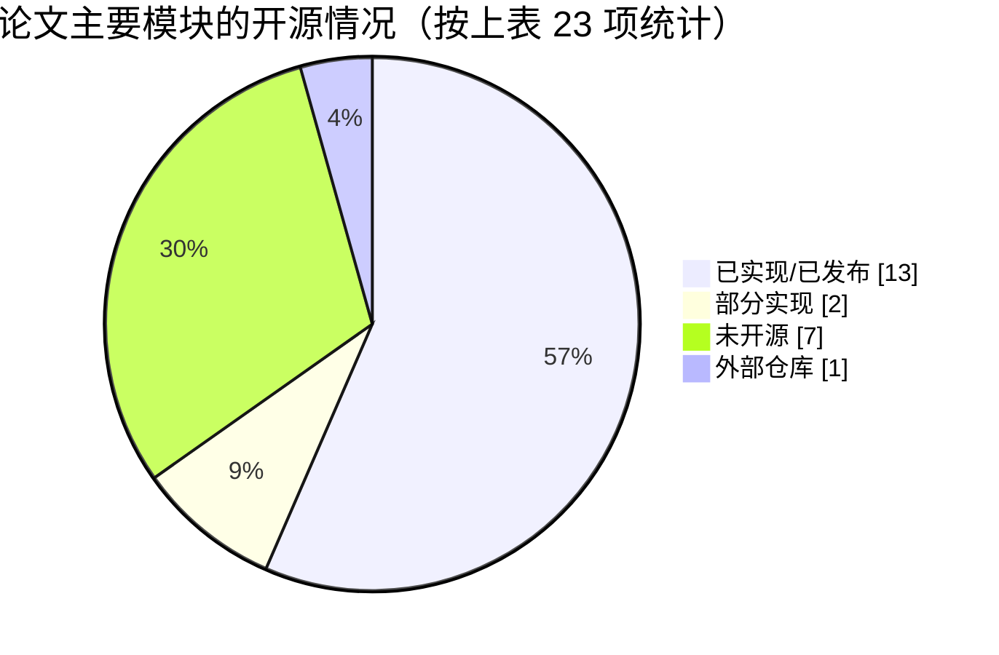

# 05 模型权重核实与论文—代码对照

> 本篇核实 HuggingFace 上两个模型的实际结构，并把论文中的每个概念映射到代码，明确**哪些已实现、哪些未开源**。
> 核实方式：下载 `model_index.json` 与各组件的 `config.json`；通过 HTTP Range 请求**只读取 safetensors 文件头部**（不下载权重本体），统计张量形状和精度。

---

## 1. HF 模型仓库内容

两个仓库的文件结构相同：

```
lcybuaa/Text2Earth  (以及 lcybuaa/Text2Earth-inpainting)
├── model_index.json                       # _class_name: Text2EarthDiffusionPipeline / ...InpaintPipeline
├── pipeline_text2earth_diffusion.py       # custom pipeline（编辑版为 ..._inpaint.py）
├── scheduler/scheduler_config.json
├── text_encoder/config.json + model.safetensors        1361.6 MB
├── tokenizer/{vocab.json, merges.txt, ...}
├── unet/config.json + diffusion_pytorch_model.safetensors  1736.0 MB
├── vae/config.json + diffusion_pytorch_model.safetensors    334.6 MB
└── feature_extractor/preprocessor_config.json
```

单个模型约 **3.4 GB**，两个合计约 6.9 GB。

---

## 2. 组件结构与参数量

| 组件 | 参数量 | 存储精度 | 关键配置 |
|---|---:|---|---|
| UNet | **868.0M** | FP16 | 见下表 |
| Text Encoder | **340.4M** | FP32 | `CLIPTextModel`，hidden 1024，**23 层**，16 头，最大位置 77，GELU（OpenCLIP ViT-H/14 文本塔，SD2 去掉了最后一层） |
| VAE | **83.7M** | FP32 | `AutoencoderKL`，`block_out_channels=[128,256,512,512]`，4 通道潜变量 |
| **合计** | **1.292B** | | 与论文的“1.3 billion parameters”一致 |

### 2.1 UNet 配置对比

| 配置项 | Text2Earth | Text2Earth-inpainting | SD2-base（参照） |
|---|---|---|---|
| `_name_or_path` | `stabilityai/stable-diffusion-2-base` | `stabilityai/stable-diffusion-2-inpainting` | — |
| `in_channels` | 4 | **9** | 4 |
| `out_channels` | 4 | 4 | 4 |
| **`class_embed_type`** | **`"timestep"`** | **`"timestep"`** | `null` |
| `num_class_embeds` | null | null | null |
| `block_out_channels` | [320, 640, 1280, 1280] | 同左 | 同左 |
| `attention_head_dim` | [5, 10, 20, 20] | 同左 | 同左 |
| `cross_attention_dim` | 1024 | 1024 | 1024 |
| `use_linear_projection` | true | true | true |
| `sample_size` | 64（⚠ 对应 512 px） | 64 | 64 |
| `resnet_time_scale_shift` | default | default | default |
| `_diffusers_version` | 0.29.0.dev0 | — | — |

**唯一的结构差异**就是 `class_embed_type: "timestep"`，它让 UNet 多出 `class_embedding.linear_1/linear_2` 共 4 个张量（约 2.05M 参数）：

```
class_embedding.linear_1.weight  [1280, 320]   F16
class_embedding.linear_1.bias    [1280]        F16
class_embedding.linear_2.weight  [1280, 1280]  F16
class_embedding.linear_2.bias    [1280]        F16
conv_in.weight                   [320, 4, 3, 3]  (Text2Earth)
conv_in.weight                   [320, 9, 3, 3]  (Text2Earth-inpainting)
```

SD2-base 的 UNet 约 865.9M，加上 2.05M 正好是 868.0M。

### 2.2 调度器配置

| 项 | Text2Earth | Text2Earth-inpainting |
|---|---|---|
| `scheduler_config._class_name` | `DDIMScheduler` | `PNDMScheduler` |
| `model_index` 中声明的类 | `PNDMScheduler` | `PNDMScheduler` |
| β 区间 / 调度 | 0.00085 ~ 0.012，`scaled_linear` | 同左 |
| 训练步数 | 1000 | 1000 |
| `prediction_type` | 未设置 → 默认 `epsilon` | 同左 |
| `steps_offset` / `set_alpha_to_one` | 1 / false | 同左 |

调度器参数与 SD2-base 完全一致（SD2-base 是 epsilon 预测，SD2-768 才是 v 预测）。

---

## 3. 论文概念 → 代码映射

| 论文概念 | 论文位置 | 代码位置 | 实现方式 |
|---|---|---|---|
| VAE 编码器 \(\mathcal{E}\) / 解码器 \(\mathcal{D}\) | IV-A-1 | `models/autoencoders/autoencoder_kl.py`（diffusers 原生） | `pipe.vae.encode` / `decode`，缩放系数 0.18215 |
| 前向加噪 \(z_t\) | IV-A-2 | `schedulers/*`（原生） | 推理时由 `scheduler.step` 执行反向过程 |
| 文本编码器 \(\mathcal{T}\)（OpenCLIP ViT-H） | IV-A-3 | `transformers.CLIPTextModel` + `encode_prompt` | 原生 |
| 交叉注意力 | IV-A-3 | `models/attention_processor.py`（原生） | `encoder_hidden_states=prompt_embeds` |
| **分辨率输入 \(I_s\)** | IV-A-3 | 两个 pipeline 的 `_GOOGLE_LEVEL_` 解析段 | 提示词前缀 → 整数 Level |
| **分辨率嵌入 \(\rho=f_\theta(I_s)\)** | IV-A-3 | `unet_2d_condition.py::_set_class_embedding` / `get_class_embed`（原生） | `time_proj`（正弦）+ `class_embedding`（TimestepEmbedding MLP） |
| **\(c_{st}=\rho+g_\theta(t)\)** | IV-A-3 | `unet_2d_condition.py::forward` 中 `emb = emb + class_emb` | 原生 |
| 掩码图像条件 \(z_{cond}=[z_m,z_t]\) | IV-A-3 | 重绘 pipeline 第 1411–1412 行 | 实际为 `cat[z_t, mask, z_m]`，9 通道 |
| **DCA 训练（条件随机丢弃）** | IV-B-1, Alg.1 | **未开源** | — |
| **DCA 采样（联合 CFG）** | IV-B-2, Alg.2 | 两个 pipeline 的 `res_in = cat[res_null, res]` + 原生 CFG 合成 | ✔ |
| 空文本 \(\tau_\varnothing\) | Alg.1/2 | `encode_prompt` 中 `uncond_tokens = [""]` | 原生 |
| 空分辨率 \(\rho_\varnothing\) | Alg.1/2 | `res_null = [0]*batch_size` | Level 0 |
| 引导系数 ω | IV-B-2 | `guidance_scale`（s = 1 + ω） | 原生 |
| Text2Earth\(_t\) / Text2Earth\(_e\) | V-B | HF `lcybuaa/Text2Earth` / `lcybuaa/Text2Earth-inpainting` | ✔ |
| 两阶段训练（全量 → 美学分数 > 4.8） | V-B | **未开源** | — |
| 画质增强模型 | III-A | `Tools/visual_enhancement.py` + 权重 | ✔ |
| GPT-4o 自动标注 | III-B | **未开源** | — |
| 美学评分 | III-C | **未开源**（使用的是外部 LAION aesthetic predictor） | — |
| FID / Zero-shot OA / CLIP Score 评测 | V-C | **未开源** | — |
| RSICD LoRA 微调 | V-D | **未开源**（diffusers 本身支持加载 LoRA：`pipe.load_lora_weights`） | — |
| 图像编辑 / 去云 | V-E | 重绘 pipeline | ✔ |
| 无界外扩 | V-F | **没有脚本**（可以基于重绘 pipeline 自行实现） | 部分 |
| Text2SAR/NIR/PAN（LoRA） | V-G-1 | **权重和训练代码均未开源** | — |
| 图像翻译（ControlNet 式模块） | V-G-2 | `pipeline_controlnet.py` + `models/controlnet.py` 的修改（只有推理端），**ControlNet 权重未开源** | 部分 |
| 数据增强实验 | V-H-1 | 未开源 | — |
| Git-RSCLIP | V-H-2 | 独立仓库 `Chen-Yang-Liu/Git-RSCLIP` | 外部 |

---

## 4. 开源完成度一览



| 状态 | 模块 |
|---|---|
| ✔ **已实现** | VAE、文本编码器、交叉注意力、分辨率输入、分辨率嵌入、嵌入相加、掩码条件、DCA 采样、空文本、空分辨率、引导系数、两个模型权重、画质增强、图像编辑（以上多数由 diffusers 原生代码 + 配置实现） |
| ◐ **部分实现** | 无界外扩（有重绘能力，没有外扩流程）、图像翻译（有推理端改动，没有权重） |
| ✗ **未开源** | DCA 训练、两阶段训练、GPT-4o 标注、美学评分、评测代码、所有 LoRA（RSICD / 多模态）、数据增强实验 |

> 统计说明：该饼图按第 3 节表格的 26 行计数，只用于直观展示，不代表工作量比例。“已实现”中的大部分条目由 diffusers 原生代码加模型配置提供，并不是作者新写的代码。

---

## 5. 论文与代码不一致之处

| # | 项目 | 论文 | 代码 / 权重 |
|---|---|---|---|
| 1 | 掩码条件拼接 | \([z_m, z_t]\)，\(c+c_m\) 通道 | \([z_t, m, z_m]\)，4 + 1 + 4 = 9 通道 |
| 2 | 分辨率编码 | “projection layer” | 正弦编码 + 两层 MLP（`TimestepEmbedding`） |
| 3 | 分辨率取值 | 0.5 m ~ 128 m | 以 Google Level 10 ~ 18 输入，且只支持整数 |
| 4 | 引导系数 | ω = 3 最优，公式为 \((1+\omega)\epsilon_c-\omega\epsilon_u\) | README 中 `guidance_scale = 3.5`；重绘 pipeline 默认 3.5；文生图 pipeline 默认仍为 7.5 |
| 5 | 初始化 | 未提及 | SD2-base / SD2-inpainting |
| 6 | 生成尺寸 | 256 × 256 | `sample_size=64` → pipeline 默认生成 512 × 512，需要显式传入 256 |
| 7 | 采样算法 | Algorithm 2 为 DDPM 祖先采样 | 默认 PNDM，README 用 Euler 离散求解器，都不是 DDPM 祖先采样；采样器可以替换，不影响模型本身 |
